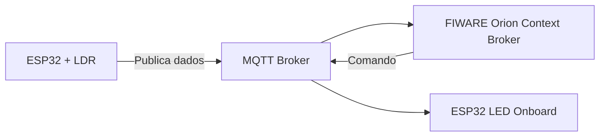

# FIWARE SMART LAMP ESP32

## 📖 Sobre o Projeto

O FIWARE SMART LAMP ESP32 é uma Prova de Conceito (PoC) que marca o início da utilização da plataforma FIWARE como back-end de uma solução maior de monitoramento global de vinherias.

O projeto utiliza a plataforma FIWARE integrada a um ESP32 DEVKIT V1, permitindo comunicação em tempo real via protocolo MQTT.

A solução simula um cenário de monitoramento em vinherias, utilizando um sensor LDR e um LED onboard como atuador.

---
🎯 Objetivo Principal

O foco deste projeto é:

🚨 Iniciar o uso do FIWARE como back-end da solução de monitoramento de vinherias, validando comunicação, integração e controle remoto em tempo real.

## 🎯 Objetivos Gerais

* Implementar o FIWARE no Google Cloud
* Criar uma entidade lógica para o dispositivo IoT
* Monitorar luminosidade em tempo real
* Controlar remotamente o LED onboard do ESP32
* Validar comunicação via MQTT
* Simular o sistema no Wokwi
* Simular um cenário real de automação agrícola

---

## 🧠 Arquitetura da Solução


### 🔄 Fluxo de Comunicação



---

## ⚙️ Tecnologias Utilizadas

* FIWARE
* Google Cloud Platform
* ESP32 DEVKIT V1
* MQTT
* Wokwi
* Postman
* Linguagem C++ (Arduino)

---

## 🔌 Funcionamento

### 📡 Monitoramento de Luminosidade

O ESP32 realiza a leitura do sensor LDR (simulado por potenciômetro), converte os valores para porcentagem e envia via MQTT:

```
/TEF/lamp002/attrs/l
```
---

#### Comandos:

| Comando     | Ação               |
| ----------- | ------------------ |
| lamp002@on  | Liga o LED onboard |
| lamp002@off | Desliga o LED      |

---

## ☁️ Configuração do FIWARE

* Instalação realizada no Google Cloud
* Broker MQTT configurado
* Integração com Orion Context Broker
* Health Check executado com sucesso

## ☁️ FIWARE como Back-end
Neste projeto, o FIWARE atua como o núcleo central da solução, sendo responsável por:

* Receber dados dos dispositivos IoT
* Gerenciar o contexto das entidades
* Permitir integração com aplicações externas
* Viabilizar escalabilidade da solução

Essa abordagem permite evoluir o projeto para um sistema completo de:

🍇 Monitoramento global de vinherias
📊 Análise de dados ambientais
🤖 Automação inteligente
---

## 🧪 Simulação

🔗 **Wokwi:**
*https://wokwi.com/projects/459135998760928257*

---

## 🎥 Demonstração

🔗 **Vídeo:**
*https://youtu.be/gYjKzG3erHM?si=gIhf7hQXuqpwdWLL*

O vídeo demonstra:

* Envio de dados de luminosidade
* Comunicação com FIWARE
* Controle remoto do LED via Postman

---

## 📬 Testes com Postman

Exemplo de comandos:

```
lamp002@on|
lamp002@off|
```

---

## 📊 Resultados

✔ Comunicação MQTT funcional
✔ Integração com FIWARE validada
✔ Controle remoto do dispositivo
✔ Monitoramento em tempo real

---

## 👩‍💻 Autores

* Giovanna Oliveira Ferreira Dias – RM 566647
* Maria Laura Druzeic – RM 566634
* Marianne Mukai Nishikawa – RM 568001

---

## 🏁 Conclusão

O projeto representa o primeiro passo na construção de uma arquitetura IoT escalável, utilizando o FIWARE como back-end para aplicações reais.

A solução demonstra como integrar dispositivos físicos, comunicação MQTT e plataformas cloud para criar sistemas inteligentes e conectados.

---

## ⭐ Observação

Este projeto foi desenvolvido como parte de um **Check Point acadêmico**, aplicando conceitos reais de IoT e Cloud Computing.

---
